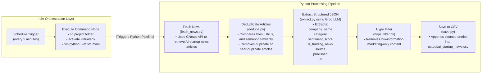

# **Analyst Agent – Automated AI Startup News Pipeline**

This project is the implementation of **Option 2: The Analyst Agent**, combining Python, Groq LLM, and n8n automation to build a fully automated pipeline that fetches, cleans, enriches, and stores structured AI startup news.

---

## 1. Task Chosen

I selected **Option 2: Advanced Automation – The Analyst Agent** because it best demonstrates:

* Automation engineering with scheduling  
* Pipeline design and modular processing  
* JSON extraction using LLMs  
* Deduplication and data quality logic  
* Orchestration using n8n  
* Token-efficient prompting and controlled LLM usage

This task integrates both backend structuring and workflow automation, reflecting real-world analyst systems.

---

## 2. Workflow Explanation

### Folder Structure

The project is organized into a clean, modular structure separating data ingestion, processing, and automation components.
```
analyst-agent/
│
├── src/
│   ├── fetch_news.py          ← Fetches AI startup news from API
│   ├── dedupe.py              ← Applies duplicate removal logic
│   ├── extract.py             ← LLM-powered JSON extraction
│   ├── hype_filter.py         ← Filters out low-information articles
│   ├── save.py                ← Appends processed data to CSV
│   └── main.py                ← Orchestrates the full pipeline
│
├── data/                      ← Optional: Raw or intermediate storage
│
├── output/
│   └── ai_startup_news.csv    ← Final enriched dataset (auto-updated)
│
├── assets/                    ← Screenshots for README
│   ├── n8n_workflow.png       ← Workflow graph showing Trigger + Execute nodes
│   ├── n8n_logs.png  ← Execution history (runs every 5 minutes)
│   ├── csv_file_screenshot.png         ← Screenshot of ai_startup_news.csv content
│   └── terminal_log.png         ← Terminal running python -m src.main
│
├── requirements.txt           ← Python dependencies
├── README.md                  ← Documentation
├── .gitignore                 ← Files excluded from versioning
└── workflow.json              ← Exported n8n workflow (recommended)
```

The system works as an automated analyst pipeline that periodically collects AI-startup-related news, processes it through multiple quality stages, and stores the cleaned information in a machine-friendly dataset.

**This workflow performs:**
* Robust news ingestion and cleansing  
* Intelligent deduplication of similar articles  
* Strict JSON extraction using Groq LLM  
* Filtering out low-information “hype” content  
* Automated scheduling and orchestration through n8n  

---


###  Workflow Diagram


### 2.1 Fetch News  
The workflow begins by retrieving the latest AI-startup news from the GNews API.  
Only essential fields (title, description, source, publication time, URL) are collected to keep downstream processing efficient and reduce token usage.

---

### 2.2 Remove Duplicates  
Multiple sources often report the same event.  
The deduplication module removes repeated articles using:

* Normalized title comparison  
* URL equality  
* Simple fuzzy matching  
* Company/entity similarity  

This ensures the dataset contains only unique, meaningful stories.

---

### 2.3 Extract Structured JSON  
Each unique article is passed to a Groq LLaMA model with a strict extraction prompt.  
The model returns structured JSON containing four fields:

* company_name  
* category  
* sentiment_score  
* is_funding_news  

Invalid or malformed JSON responses are discarded automatically.

---

### 2.4 Hype Filtering  
Low-information-density articles (generic summaries, marketing fluff, non-technical content) are removed.  
This ensures only relevant, factual news remains in the dataset.

---

### 2.5 Save Output  
All valid structured entries are appended to:

output/ai_startup_news.csv

This file grows continuously as the workflow runs periodically.

---

## 3. Python Usage Instructions

### 3.1 Clone the repository  
(Insert code block manually)  
git clone YOUR_REPO_LINK  
cd analyst-agent

---

### 3.2 Create and activate virtual environment  
(Insert code block manually)  
python3 -m venv venv  
source venv/bin/activate

---

### 3.3 Install dependencies  
(Insert code block manually)  
pip install -r requirements.txt

---

### 3.4 Add environment variables  
Create a `.env` file with:

GNEWS_API_KEY=your_key  
GROQ_API_KEY=your_key  

---

### 3.5 Run the pipeline  
(Insert code block manually)  
python3 -m src.main

The final dataset is saved in:  
output/ai_startup_news.csv

---

## 4. n8n Automation Instructions

### 4.1 Start n8n locally  
(Insert code block manually)  
npx n8n

Then open:  
http://localhost:5678

---

### 4.2 Create a new workflow  
Add two nodes:

1. **Schedule Trigger**  
   - Runs every 5 minutes

2. **Execute Command**  
   - Runs the Python pipeline automatically

---

### 4.3 Command used in Execute Command  
(Insert code block manually)  
cd /Users/muhammedjasim/Desktop/analyst-agent &&  
source analyst-agent/venv/bin/activate &&  
python3 -m src.main  

---

### 4.4 Activate the workflow  
Once activated, n8n will run the Python pipeline every 5 minutes and continuously update the CSV file.

---

## 5. Deduplication Logic

The deduplication algorithm ensures the dataset contains only unique news stories by performing:

* Lowercasing and trimming all titles  
* Exact URL matching  
* Title similarity matching  
* Entity or company name overlap detection  

This prevents the same news event from being stored multiple times even if published by different outlets.

---

## 6. Token Efficiency

To minimize model usage and maintain speed:

* Only essential fields are sent to the LLM (title + description)  
* No HTML, body text, or full article content is used  
* Prompt instructs model to output strict JSON only  
* No chain-of-thought or verbose reasoning  
* Short, structured extraction prompts  

This keeps LLM calls fast, cheap, and predictable.

---

## 7. Error Handling

The workflow includes robust error protection:

* API failures and timeouts are caught  
* Empty API responses are safely skipped  
* LLM invalid JSON is handled with try/except  
* Articles failing extraction do not break the pipeline  
* Hype filtering prevents useless entries  
* n8n retries if execution fails  

This ensures that the pipeline remains stable and produces reliable outputs even under partial failures.

---

## 8. Final Output

All validated structured entries are stored in:

output/ai_startup_news.csv

This file continuously grows as new batches of news are processed every 5 minutes through n8n.

